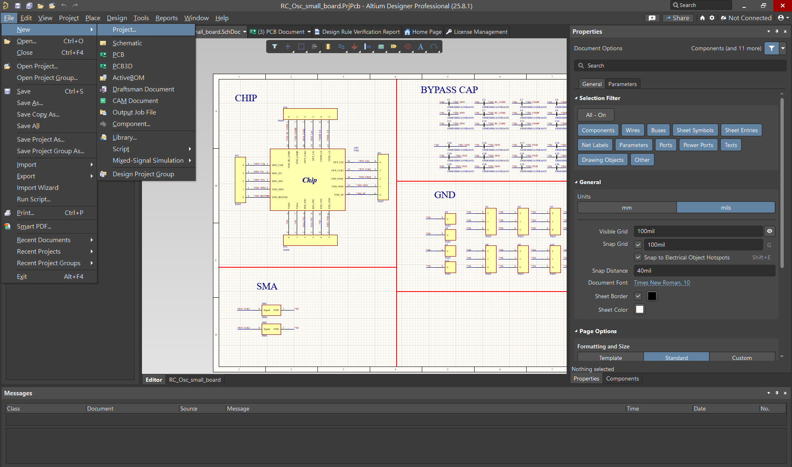
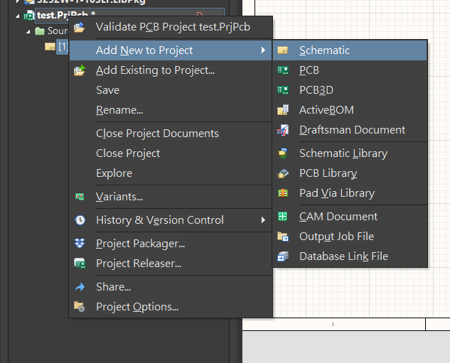
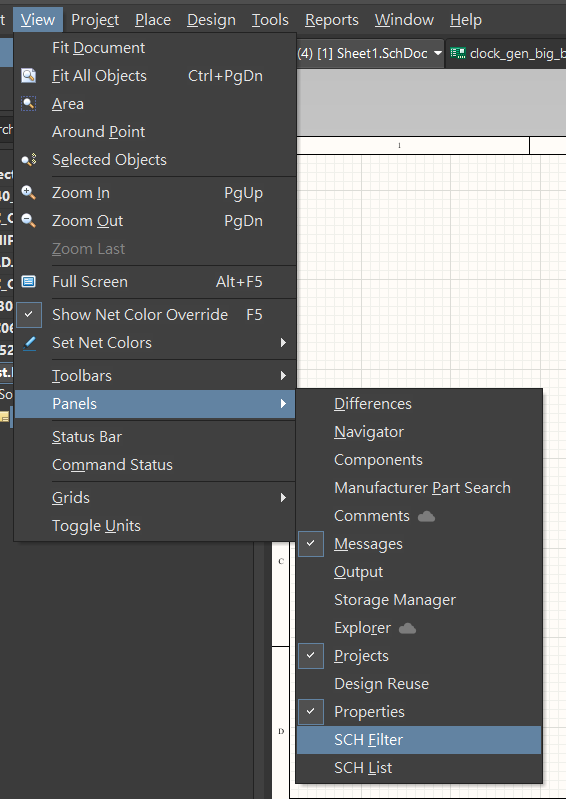
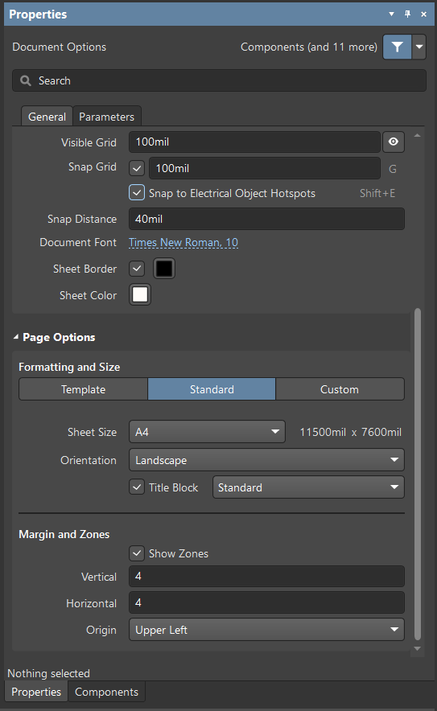
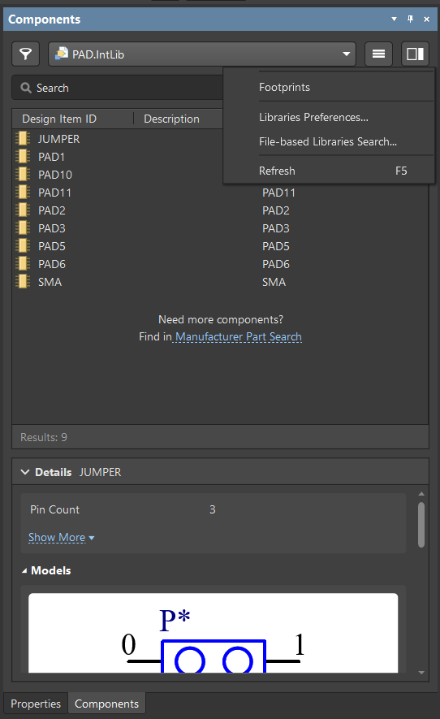
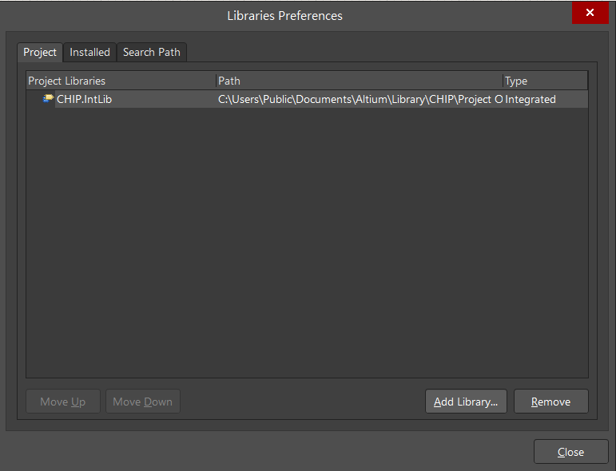
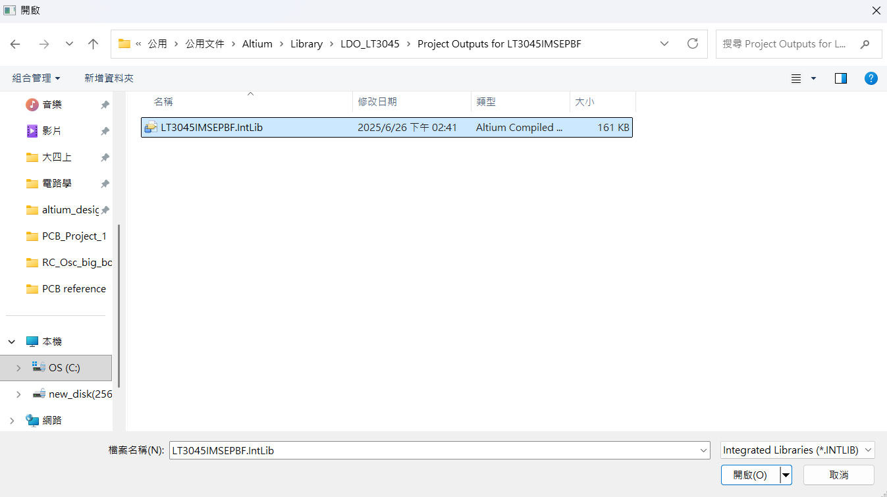
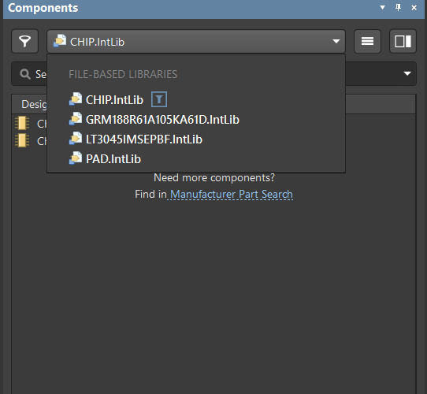
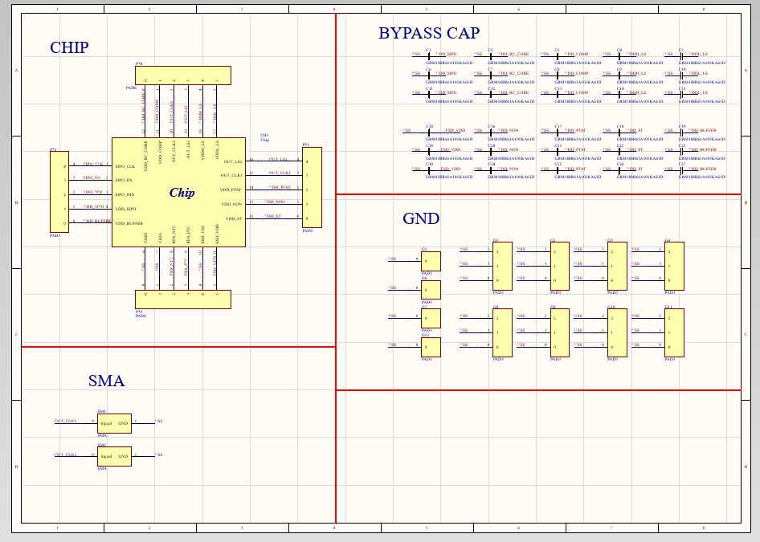

# 02｜如何開啟專案、並製作原理圖 (Schematics)

這一章會講：

1. **如何開啟新專案**
2. **如何繪製原理圖(Schematics)**
3. **如何打開 library 並放置元件**
4. **一些常用的快捷鍵**
   
---

## 開啟新專案 & Schematics
`File → New → Project`

在剛新建的專案上點擊滑鼠右鍵

`Add new to project → Schematics`

就可以打開一個空白的 Schematic ，此時右側應該會出現 Properties( Properties 是用來調整元件參數、位置、旋轉角度等等的 panel)

在這裡我們可以透過 Properties 來編輯我們 schematic 背景的大小、網格、標題等等

如果沒有看到 Properties (或不小心關掉) 可以透過以下步驟將其打開 (可以順便把 Component 也打開，Component 是用來放置元件的 Panel )

`View → Panels → Properties (Components)`

在 Properties 中：
- Title block：關掉或打開右下角的 title
- Sheet size：調整原理圖的大小
- Grid : 調整網格大小 
  

---

## 接下來要講如何匯入已經有的 library 並且如何放置元件

首先，先打開 Component 的 Panel，點擊附圖三槓的格子
並選擇 Libraries Preferences，打開後點選 Add Library
把學長給的 Library 重複這個步驟，一個一個點開來

之後就可以看到裡面有不同的 Library 點選後就可以放到 Schematics 上面！(關於製作自己 chip 的方法，會在 [03_create_library.md](03_create_library.md) 講解，底下將介紹如何繪製 Schematics )

---

## 如何繪製 Schematics
一些操作與快捷鍵
- `CTRL` + 滾輪： Zoom in / out
- `CTRL` + w：接線
- 滑鼠按住右鍵可以拉上下左右
- 滑鼠按住左鍵可以選取元件：從右到左 要將整個元件框到才會選到；從左到右 只要有框到就會整個選起來
- 選取元件時按住 `SHIFT` 可以一次選多個元件
- `CTRL` + `c` / `CTRL` + `v`：複製貼上
- 在貼上元件時：`SPACE`：逆時針旋轉90度；`x`：延 x 軸鏡像；`y`： 延 y 軸鏡像
- 在左上角的 `Place → Net Label` 可以幫線取名，同樣名字的線會預設自動接在一起
 

- A：添加一些文字(可以幫不同區塊取名)
- A 旁邊那個鍵，按右鍵可以選擇要畫甚麼，可以畫一些線把不同區塊圈起來(在畫的時候可以按 `TAB` 可以調整線的粗細與顏色)
- (如底下附圖的紅線與文字)
   

如此基本上就可以完成 Schematic 的繪製，下一張會介紹要如何自己製作 Library (像是 chip、pad 等等)
## 👉 下一章：如何建立新的library  
前往：**[03_create_library.md](03_create_library.md)**
   