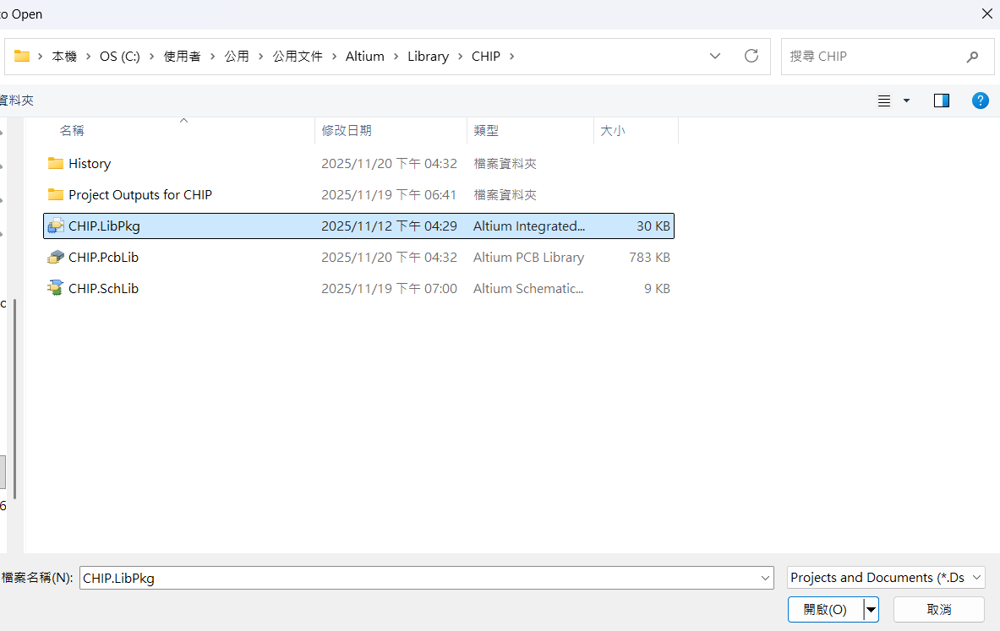
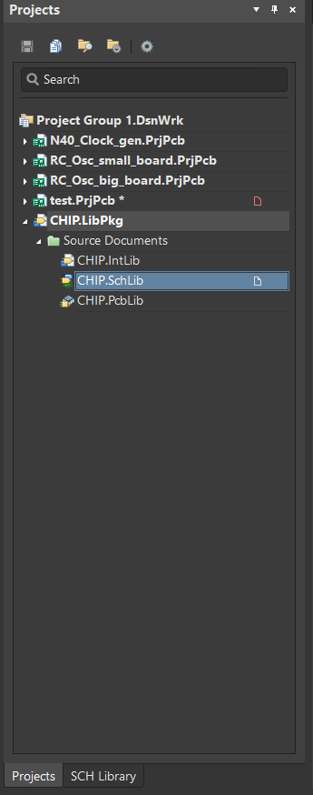
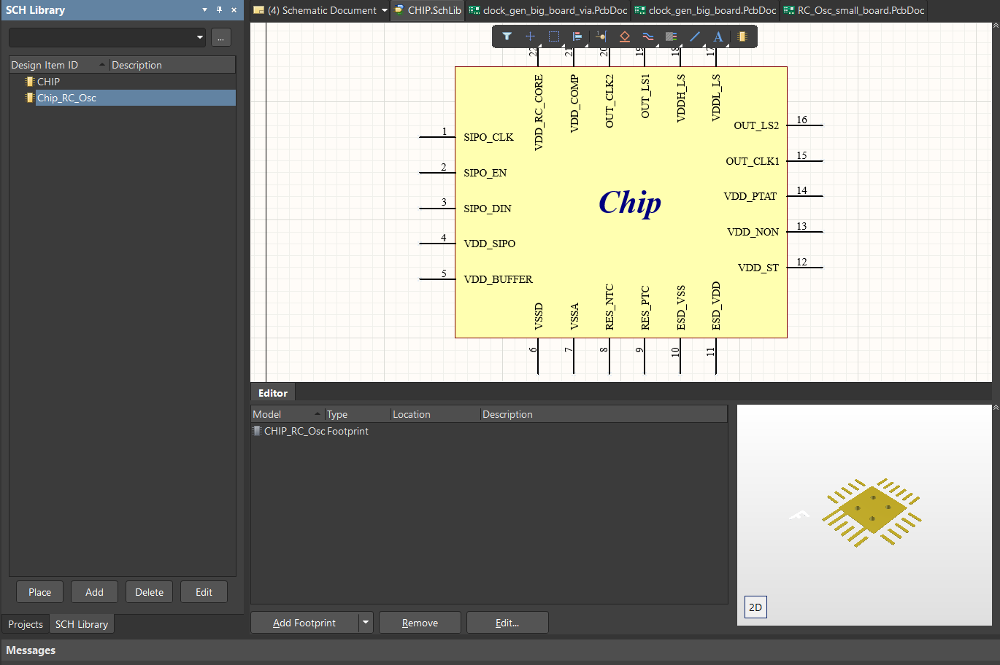
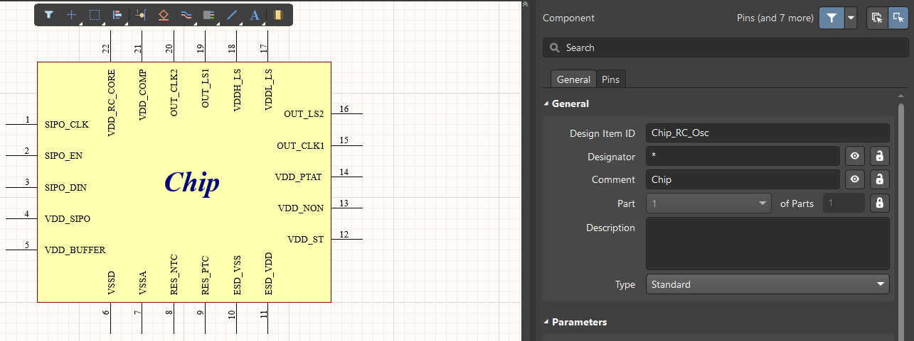
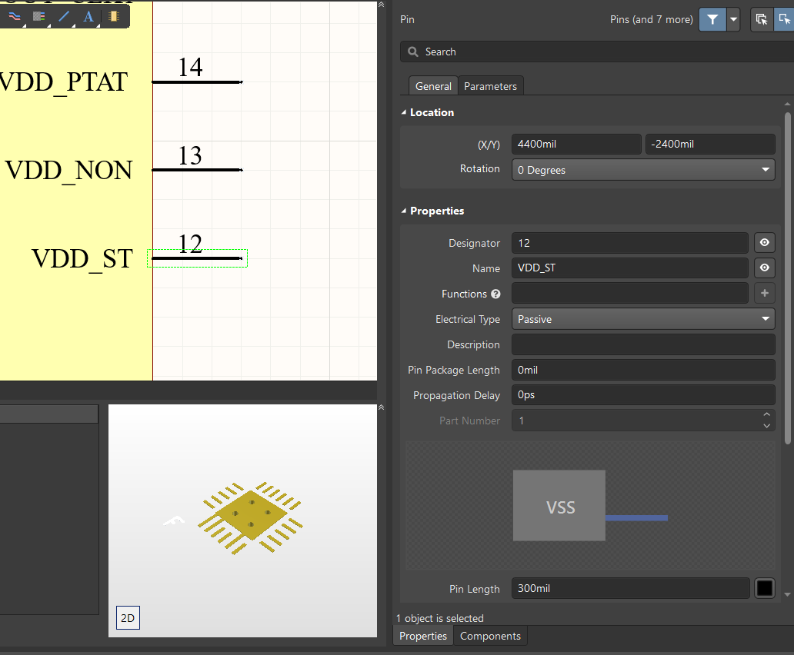
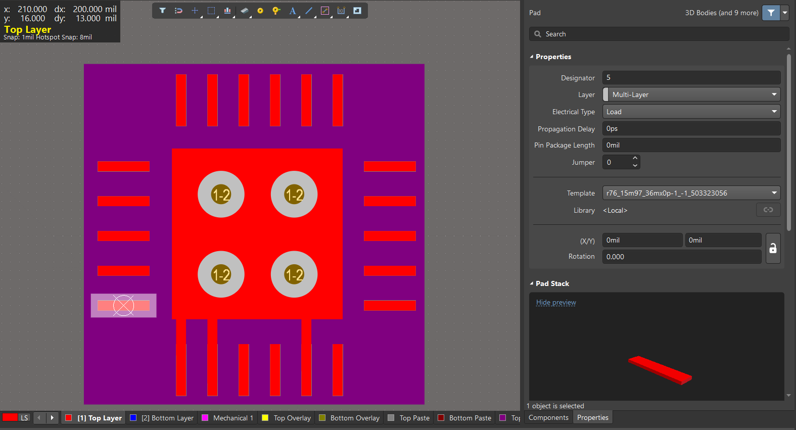
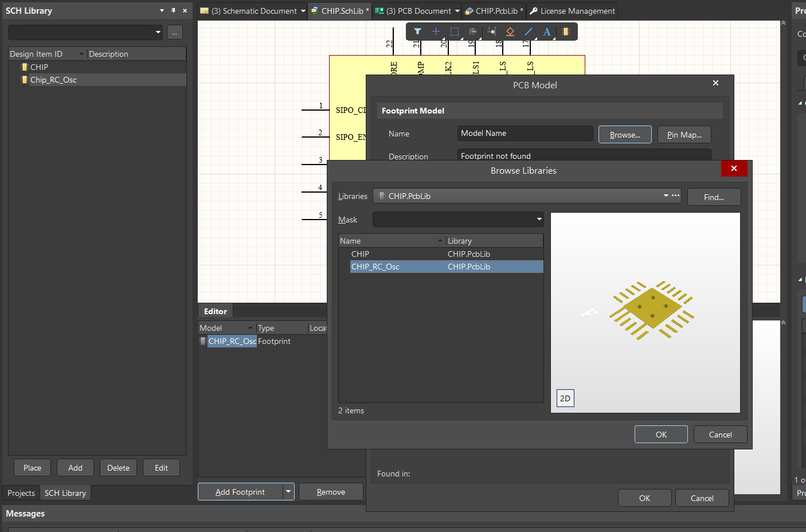
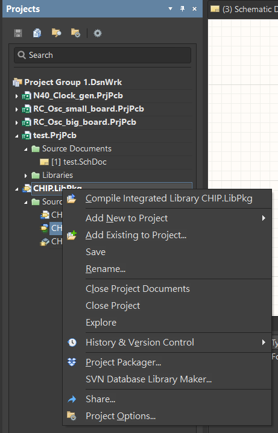

# 03｜如何新增Library 並且封裝 (Add footprint)

這一章會講：

1. **如何新增元件(Add library)**
2. **如何封裝(Add footprint)**
3. **如何叫出新增的原件**
   
---

在畫自己的 PCB 時，難免會遇到自己所需要的原件不在 Library 的元件中的問題，此時就需要自己畫 Schematic 以及 PCB。這章就是要講如何繪製新的原件。

---

## 創建新的元件
首先，我們照下列步驟打開已有的 Library

`File → Open`

並點開 `.Pkg` 檔

點開後就會發現在 `Projects` 的 panel 中已經打開。
點開後，點到 `.SchLib` 可以看到左下角有一個 `SCH Library` 如附圖所示

點進去後就可以看到如附圖的樣子

然後可以先複製前人的檔案再進行修改(右鍵複製貼上)

- 改檔案名稱從 Design Item ID 改
- 我們可以嘗試框選起其中一個 port，可以看到 **Designator**、**Name**
- **Drsinator**：讓你Schematic連結到PCB的代號，可以理解成在Schematic和PCB中要有同樣的元件 LVS 才會過(在 PCB 中 DRC會順便檢查 LVS 問題)
  
- **Name**：讓你可以知道這隻腳叫甚麼或要接甚麼，有點像是建立symbol時給一個pad(本身無接線功能)

---
## 創建元件所要連結之PCB

只製作好Schematic是不夠的，因為到時候畫 PCB 時還是無法將元件叫出，因此我們要幫我們剛剛所新增的元件，建立一個PCB，才算是真的完整的新增元件

首先，一樣從左下回到 **Projects** 中，然後點選 **.PcbLib**，再從左下進入到 **PCB Library** 中。

同樣先複製一份學長姐的檔案，並進行修改

底下將介紹一些畫 PCB 的操作

- 可以看到背景有一層紫色的框框，這層的材質是**Top Solder**功能是不要上綠油，如果框框沒有框好的話，到時候可能會無法焊接(整塊就要重做)
- 正中間的紅色大框框是到時候晶片放置的位置，長寬抓1.5倍的 chip 的長寬
- 如果需要切換單位的話，可以在 `View → Toggle Units` 將 `mm → mil or mil → mm`
- 可以看到 pad 也有 Designator 這個到時候就會對應到 Schematic 的 Designator，有些 pad 直接和中間的板子相接，那些是 VSS
- pad、pad 間至少 10 mil 可以更遠沒關係
- 其他更多的 pcb 操作可以看 [04_pcb.md](04_pcb.md)

---

## 將 Schematic 與 PCB 連結

先點回 Schematic
然後依序點選

` Add Footprint → Browse → 點剛剛製作好的 PCB `

選好後，兩個檔案就會綁在一起！

最後回到 `Projects` 在.LibPkg 右鍵點擊 然後點選 **Compile Integrated Library xxx.LibPkg** 如果沒有報錯就沒問題了

做完這些步驟後，此時再回到原本的 Schematic 中，去看Components panel，此時剛畫好的檔案就會在Library中了！

到此為止應該就可以完整地畫完 Schematic 所需的所有知識了!下一章節會開始介紹如何開始畫 PCB！

## 👉 下一章：如何畫 PCB
前往：**[04_pcb.md](04_pcb.md)**
   