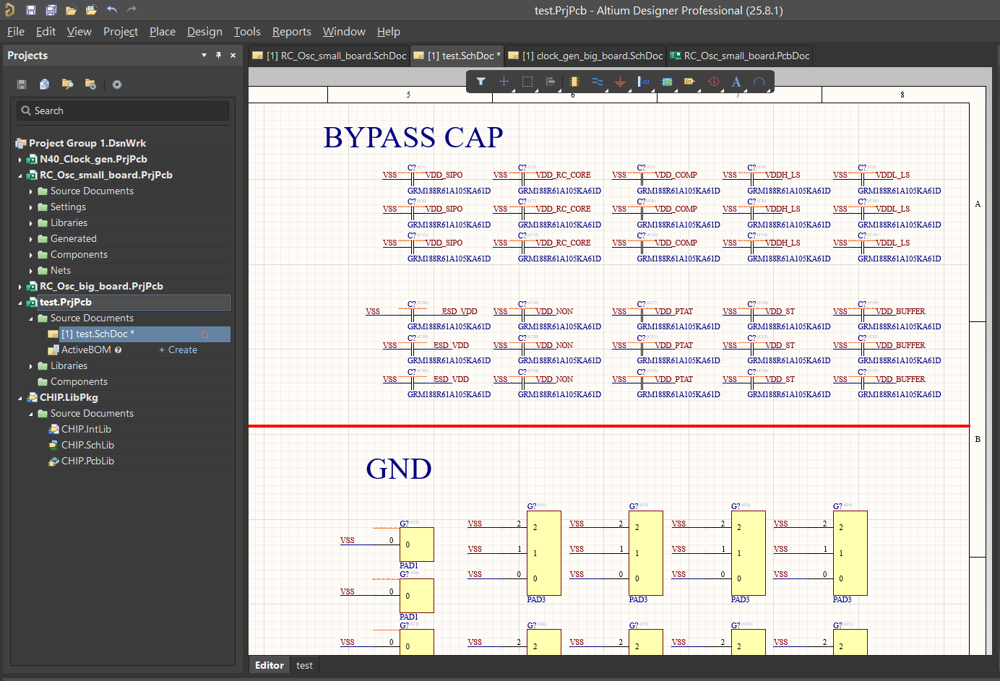
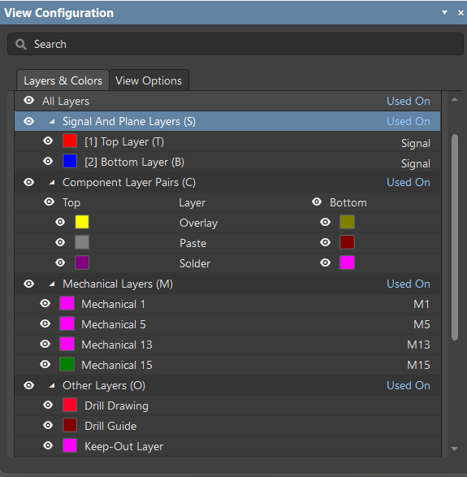
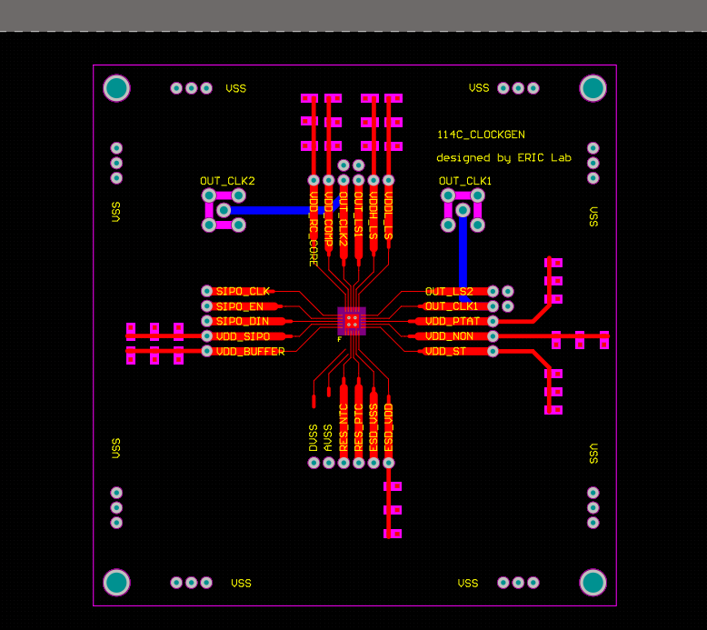
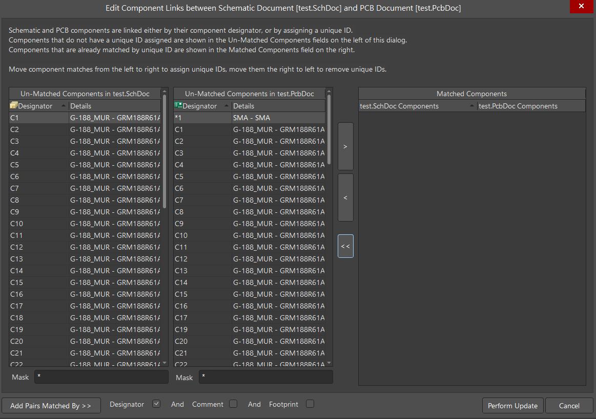

# 04｜開始繪製 PCB

這一章會講：

1. **如何自動幫元件編號**
2. **如何將 Schematic 的元件叫到 PCB 中**
3. **如何手動幫 Schematic 元件與 PCB 元件建立連結**
4. **一些繪製 PCB 的快捷鍵**
   
---

## 如何自動幫元件編號

在畫 PCB 之前，我們需要幫 Schematic 的元件一一命名，這樣在跑 DRC 時，他才能成功檢查元件有沒有接好。當然我們可以一個一個幫元件命名(Designator)，但底下介紹一個可以一口氣幫 Schematic 中所有元件命名的方法

如附圖，如果沒有特別幫元件命名的話，會看到每個元件都會是`？`

這個時候我們可以照下面流程

`Tools → Annotation → Reset Duplicate Schematic Designators`

`Tools → Annotation → Annotate Schematics Quietly`

就可以看到所有的元件都一口氣編號好了！

---

## 一些前置作業

首先，和新增 Schematic 檔案的方式一樣，先創一個新的 PCB 檔案(詳細見[02_schematic.md](02_schematic.md))

在專案上點擊滑鼠右鍵

`Add new to project → PCB`

這樣就可以創建一個新的 PCB 檔案，然後每個專案的 DRC rule 都需要重新設定，因此可以先至 [05_drc_setup](05_drc_setup.md) 將 DRC 設定好，再繼續看下去。和畫 Layout 一樣，可以沒事就跑一下 DRC 確認在擺的過程中沒有違反一些 DRC rule。

底下先介紹一下在 PCB 中的一些材質是做甚麼的(我只介紹一些會用到的)

- Top Layer / Bottom Layer：就是金屬層，因為 PCB 有上下兩面，兩面都可以拉線，彼此是獨立的
- Overlay：這是可以在 PCB 上寫字，並不會影響接線結果，到時候印出來就是有字在上面(設計前期可以先把它關掉)
- Solder：在前面介紹 chip 時有提到，鋪上這層後就不會上綠油
- Keep-Out Layer：是整片 PCB 的邊界
- (其他我也沒用過，如果後人有用到可以再幫我編輯)

接著我們可以先將學長姐的檔案複製到我們的 PCB 中，貼過來後，我們要先把鋪好的銅給先刪掉(關於鋪銅是在做甚麼 可以詳見[06_Polygon_pour](06_Polygon_pour.md))

刪掉鋪銅的方式
`Tools → Polygon Pours → Polygon Manager`
(`Tools → Polygon Pours → Shelve Polygon` 是將鋪銅隱藏而已，最後可能還是要刪掉 否則 DRC 會報錯)

點進去後可以將所有的鋪銅刪掉(右鍵 → Delete)

接下來就可以得到如下圖一般的 PCB

接下來就要介紹如何將 Schematic 的元件叫到 PCB 中！

## 如何將 Schematic 的元件叫到 PCB 中

照著以下步驟可以將所有 Schematic 的元件叫到 PCB 中

`Design → Import Changes From xxxx.PrjPcb`
可以先按 `Automatically Create Componets Link`
然後左下先按 `Validate Changes` 再按 `Excute Changes` 就可以把所有 Schematic 的元件叫到 PCB 中了！

但有的時候，我們會想要沿用學長姐檔案的一些設計或一些元件的擺放位置，如果我們使用`Automatically Create Componets Link`
他可能會連結錯。因此底下將介紹如何手動的幫元件建立連結。

---

## 如何手動幫 Schematic 元件與 PCB 元件建立連結

`Project → Componet Link`

然後會看到下圖的視窗

就可以手動幫 Schematic 元件與 PCB 元件建立連結！

當它連結好後再讓他 `Automatically Create Componets Link` 就不會消失了

## 一些繪製 PCB 的快捷鍵或操作

- `CTRL` + 滾輪： Zoom in / out
- 滑鼠按住右鍵可以拉上下左右
- 滑鼠按住左鍵可以選取元件：從右到左 要將整個元件框到才會選到；從左到右 只要有框到就會整個選起來
- 選取元件時按住 `SHIFT` 可以一次選多個元件
- `CTRL` + `c` / `CTRL` + `v`：複製貼上
- 在貼上元件時：`SPACE`：逆時針旋轉90度；`x`：延 x 軸鏡像；`y`： 延 y 軸鏡像 如果失敗了，可以從Property 調整 Rotaion
- 要畫線的話 `按右鍵 → Place → Line` 就可以畫線了，然後可以用 Property 調整線的粗細、材質、Net
- `SHIFT` + `CTRL` + `r/l/t/b`：對齊所選的元件，分別是靠右/左/上/下 對齊
- `SHIFT` + `CTRL` + `h/v`：平分所選元件的距離，分別是水平平分/垂直平分
- 想到再補
  
## 👉 下一章：設定 DRC rule
前往：**[05_drc_setup.md](05_drc_setup.md)**
     